  

  

    <b>Software Architect // Full-Stack Explorer // System Optimizer</b>
  

  

---

### ⚡ SYSTEM_INFO
> **User:** `W3ndig0u0`  
> **Status:** `Active_Developing`  
> **Location:** `Stockholm, Sweden`  
> **Primary_Cores:** `JS`, `TS`, `Java`, `C#`, `Lua`, `Go`

---

🛠️ CORE_TECH_ARSENAL
🌐 Frontend & UI/UX

⚙️ Backend & Database

💻 Systems, Low-Level & Scripting

🚀 DevOps & Workflow

---

### 📈 ANALYTICS_PROTOCOL

  

  

 

  <table border="0">
    <tr>
      <td width="50%" align="center">
        <h4>🎖️ TROPHY_ROOM</h4>
        
      </td>
      <td width="50%" align="center">
        <h4>⌛ UPTIME (WakaTime)</h4>
        
      </td>
    </tr>
    <tr>
      <td width="50%" align="center">
        <h4>🔍 TECH_DISCOVERY</h4>
        
      </td>
      <td width="50%" align="center">
        <h4>🌸 MEDIA_LOG (AniList)</h4>
        
      </td>
    </tr>
  </table>

---

### 📫 ESTABLISH_CONNECTION

  
  

  

